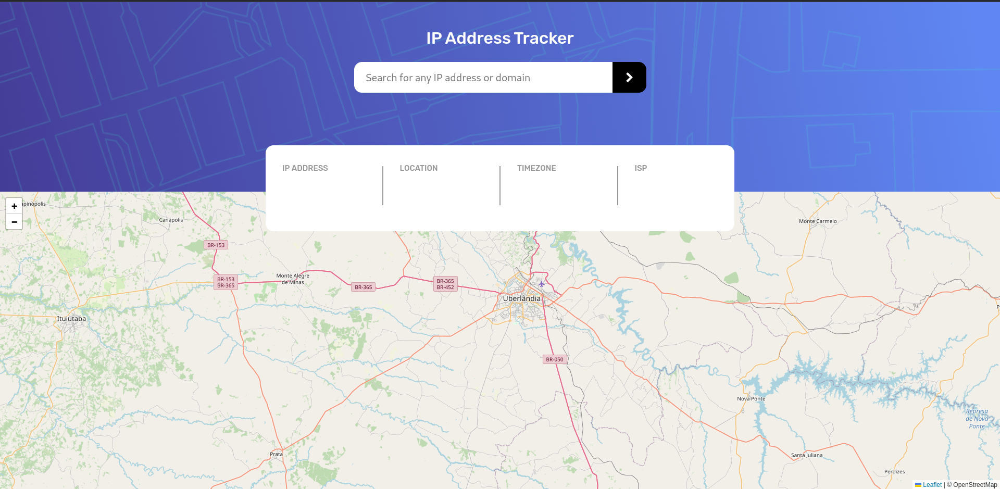

# Exercício 13 | age-calculator

## Treinando o uso de API de localização, mapeamento e IP

foi facil entender como a API funcionava e nesse caso não deu problema de fazer

<a href="https://lucasramosfs.github.io/projeto-13-ip-address-tracker/ "> Clique aqui para acessar a página</a>

### Resultado final

